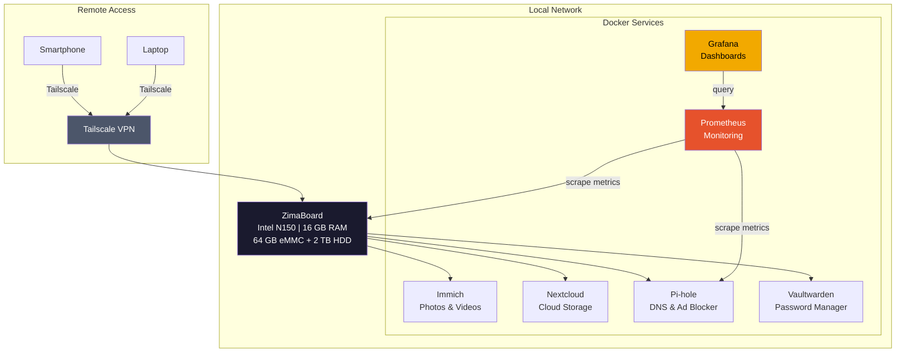
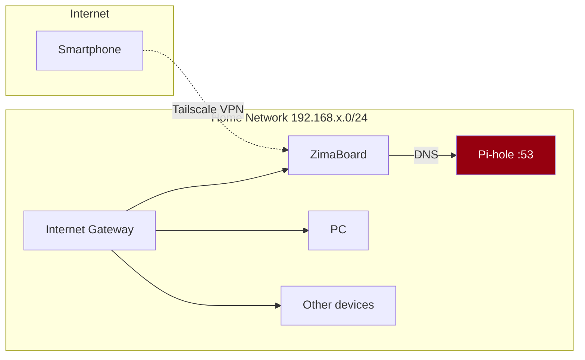

# Homelab Infrastructure

My personal cloud hosted on a ZimaBoard, running 7 self-hosted Docker services with monitoring, VPN access, and 2 TB storage.

---

## Architecture



## Hardware

| Component | Detail |
|-----------|--------|
| Board | ZimaBoard (Intel N150) |
| RAM | 16 GB |
| System storage | 64 GB eMMC |
| Data storage | 2 TB HDD |
| OS | ZimaOS |

## Services

### Storage & Media

| Service | Role | Port | Storage |
|---------|------|------|---------|
| [Immich](https://immich.app/) | Automatic photo/video backup (Google Photos alternative) | 2283 | 2 TB HDD |
| [Nextcloud](https://nextcloud.com/) | Personal cloud (files, calendar, contacts) | 443 | 2 TB HDD |

### Security & Network

| Service | Role | Port |
|---------|------|------|
| [Pi-hole](https://pi-hole.net/) | DNS sinkhole - blocks ads and trackers at the network level | 53, 80 |
| [Tailscale](https://tailscale.com/) | Mesh VPN - secure remote access to services from outside | - |
| [Vaultwarden](https://github.com/dani-garcia/vaultwarden) | Self-hosted password manager (Bitwarden-compatible) | 8080 |

### Monitoring

| Service | Role | Port |
|---------|------|------|
| [Prometheus](https://prometheus.io/) | System and service metrics collection | 9090 |
| [Grafana](https://grafana.com/) | Metrics visualization and dashboards | 3000 |

## Network & Remote Access



### Why Tailscale and not a reverse proxy?

- **No open port on the router**: Tailscale uses an encrypted WireGuard tunnel that does not require opening any port on the router. Zero attack surface from the Internet.
- **No public domain needed**: Services remain accessible via private Tailscale IPs (100.x.x.x). No need to manage SSL certificates or dynamic DNS.
- **Simplicity**: A single service to configure instead of Nginx/Traefik + Certbot + DynDNS.
- **Primary use case**: Access Immich from a phone on the go for automatic photo backup.

## Monitoring Stack (Prometheus + Grafana)

Monitoring is critical even on a homelab. If the 2 TB disk fills up without warning, photo backups are lost.

### What I Monitor

- **System metrics**: CPU, RAM, disk, temperature (via `node_exporter`)
- **Docker**: Container status, memory/CPU usage per container (via `cAdvisor`)
- **Pi-hole**: Number of queries, block percentage, most queried domains
- **Storage**: Used/remaining space on the 2 TB HDD

### Grafana Dashboard

> *Screenshots coming soon*

## Technical Decisions

### Why Self-Host?

| Service | Cloud Alternative | Reason for Self-Hosting |
|---------|-------------------|-------------------------|
| Immich | Google Photos | Full control over personal data, no storage limit |
| Nextcloud | Google Drive | Data sovereignty, no monthly subscription |
| Vaultwarden | Bitwarden cloud | Sensitive data stays at home |
| Pi-hole | - | Blocks ads across the entire network, not just the browser |

### Why ZimaBoard?

- **Low power consumption**: ~6W idle vs ~50W for a standard PC. Runs 24/7 for less than 15 EUR/year in electricity.
- **Silent**: Fanless operation possible depending on load.
- **Compact form factor**: Fits in a network closet.
- **x86**: Compatible with all Docker containers (no ARM issues like with Raspberry Pi).

### Storage Layout

```
eMMC 64 GB (system)
├── ZimaOS
├── Docker images & containers
└── Configurations

HDD 2 TB (data)
├── immich/       # Photos and videos
├── nextcloud/    # Cloud files
├── prometheus/   # Metrics (30-day retention)
└── grafana/      # Dashboards
```

## What I Learned

- Deploy and manage Docker services in production (not just as exercises)
- Set up a Prometheus + Grafana monitoring stack from scratch
- Implement a mesh VPN with Tailscale for secure remote access
- Manage network DNS with Pi-hole (understanding DNS queries, blocking, caching)
- Self-host a password manager (security awareness)
- Manage storage and anticipate capacity issues
- Maintain 24/7 services (updates, backups, monitoring)

## Planned Improvements

- [ ] Configure Grafana alerts (notification if disk > 80%, container down, etc.)
- [ ] Set up automatic backups to a second disk or remote storage
- [ ] Add a reverse proxy (Traefik) with local HTTPS certificates
- [ ] Document the docker-compose files for each service in this repo

## Credits

Personal infrastructure built and maintained by myself. All software used is open-source.
