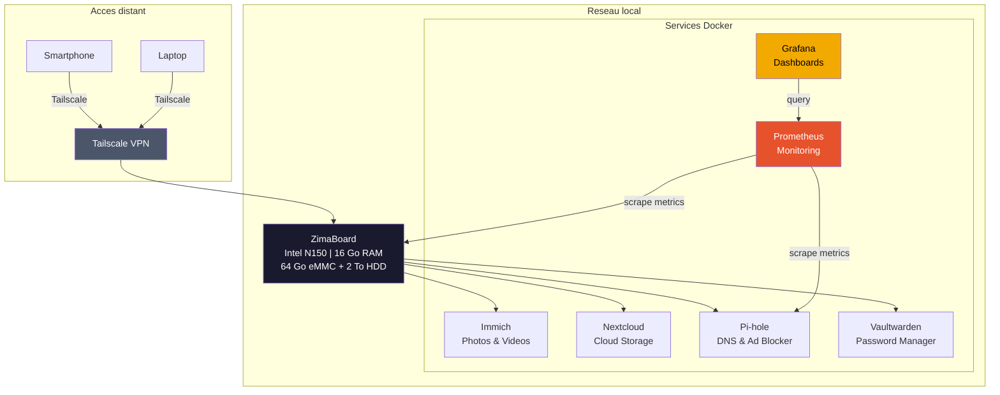
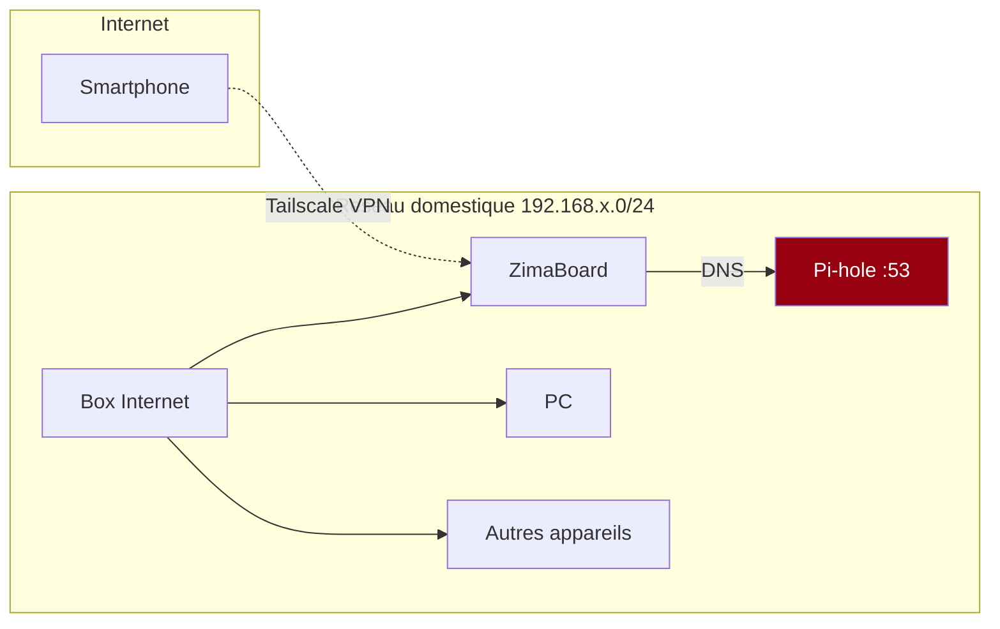

# Homelab Infrastructure

Mon cloud personnel heberge sur une ZimaBoard, gerant 7 services Docker auto-heberges avec monitoring, acces VPN et stockage 2 To.

---

## Architecture



## Hardware

| Composant | Detail |
|-----------|--------|
| Carte | ZimaBoard (Intel N150) |
| RAM | 16 Go |
| Stockage systeme | 64 Go eMMC |
| Stockage donnees | 2 To HDD |
| OS | ZimaOS |

## Services

### Stockage & Medias

| Service | Role | Port | Stockage |
|---------|------|------|----------|
| [Immich](https://immich.app/) | Sauvegarde automatique de photos/videos (alternative Google Photos) | 2283 | HDD 2 To |
| [Nextcloud](https://nextcloud.com/) | Cloud personnel (fichiers, calendrier, contacts) | 443 | HDD 2 To |

### Securite & Reseau

| Service | Role | Port |
|---------|------|------|
| [Pi-hole](https://pi-hole.net/) | DNS sinkhole - bloque les pubs et trackers au niveau reseau | 53, 80 |
| [Tailscale](https://tailscale.com/) | VPN mesh - acces securise aux services depuis l'exterieur | - |
| [Vaultwarden](https://github.com/dani-garcia/vaultwarden) | Gestionnaire de mots de passe auto-heberge (compatible Bitwarden) | 8080 |

### Monitoring

| Service | Role | Port |
|---------|------|------|
| [Prometheus](https://prometheus.io/) | Collecte de metriques systeme et services | 9090 |
| [Grafana](https://grafana.com/) | Visualisation des metriques et dashboards | 3000 |

## Reseau & Acces distant



### Pourquoi Tailscale et pas un reverse proxy ?

- **Pas de port ouvert sur la box** : Tailscale utilise un tunnel chiffre WireGuard qui ne necessite pas d'ouvrir de port sur le routeur. Zero surface d'attaque depuis Internet.
- **Pas de domaine public necessaire** : Les services restent accessibles via des IPs privees Tailscale (100.x.x.x). Pas besoin de gerer des certificats SSL ou du DNS dynamique.
- **Simplicite** : Un seul service a configurer au lieu de Nginx/Traefik + Certbot + DynDNS.
- **Cas d'usage principal** : Acces a Immich depuis le telephone en mobilite pour la sauvegarde automatique des photos.

## Stack Monitoring (Prometheus + Grafana)

Le monitoring est critique meme sur un homelab. Si le disque de 2 To se remplit sans prevenir, on perd les sauvegardes photos.

### Ce que je monitore

- **Metriques systeme** : CPU, RAM, disque, temperature (via `node_exporter`)
- **Docker** : Etat des containers, utilisation memoire/CPU par container (via `cAdvisor`)
- **Pi-hole** : Nombre de requetes, pourcentage de blocage, domaines les plus demandes
- **Stockage** : Espace utilise/restant sur le HDD de 2 To

### Dashboard Grafana

> *Captures d'ecran a venir*

## Decisions techniques

### Pourquoi auto-heberger ?

| Service | Alternative cloud | Raison de l'auto-hebergement |
|---------|-------------------|------------------------------|
| Immich | Google Photos | Controle total sur les donnees personnelles, pas de limite de stockage |
| Nextcloud | Google Drive | Souverainete des donnees, pas d'abonnement mensuel |
| Vaultwarden | Bitwarden cloud | Donnees sensibles restent chez moi |
| Pi-hole | - | Bloque les pubs sur tout le reseau, pas juste le navigateur |

### Pourquoi ZimaBoard ?

- **Faible consommation** : ~6W en idle vs ~50W pour un PC standard. Tourne 24/7 pour moins de 15 EUR/an d'electricite.
- **Silencieux** : Fanless possible selon la charge.
- **Format compact** : Tient dans un placard reseau.
- **x86** : Compatible avec tous les containers Docker (pas de problemes ARM comme le Raspberry Pi).

### Organisation du stockage

```
eMMC 64 Go (systeme)
├── ZimaOS
├── Docker images & containers
└── Configurations

HDD 2 To (donnees)
├── immich/       # Photos et videos
├── nextcloud/    # Fichiers cloud
├── prometheus/   # Metriques (retention 30j)
└── grafana/      # Dashboards
```

## Ce que j'ai appris

- Deployer et gerer des services Docker en production (pas juste en exercice)
- Configurer un stack de monitoring Prometheus + Grafana from scratch
- Mettre en place un VPN mesh avec Tailscale pour l'acces distant securise
- Gerer le DNS reseau avec Pi-hole (comprendre les requetes DNS, le blocage, le cache)
- Auto-heberger un gestionnaire de mots de passe (sensibilite securite)
- Gerer le stockage et anticiper les problemes de capacite
- Maintenir des services 24/7 (mises a jour, sauvegardes, monitoring)

## Ameliorations prevues

- [ ] Configurer des alertes Grafana (notification si disque > 80%, container down, etc.)
- [ ] Mettre en place des sauvegardes automatiques vers un second disque ou du stockage distant
- [ ] Ajouter un reverse proxy (Traefik) avec certificats HTTPS locaux
- [ ] Documenter les docker-compose de chaque service dans ce repo

## Credits

Infrastructure personnelle montee et maintenue par mes soins. Les logiciels utilises sont tous open-source.
