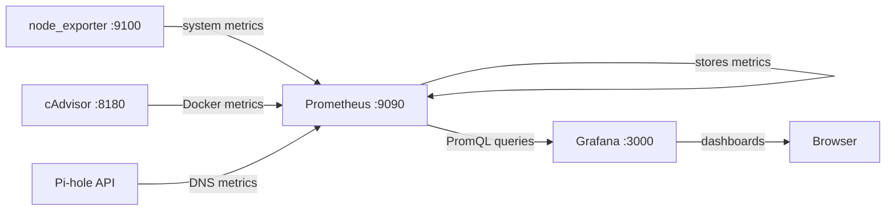

# Monitoring Stack: Prometheus + Grafana

## Architecture



## Prometheus

Prometheus scrapes (collects) metrics from each exporter at regular intervals and stores them locally.

### Sample Configuration (`prometheus.yml`)

```yaml
global:
  scrape_interval: 15s        # Collection frequency
  evaluation_interval: 15s    # Alert evaluation frequency

scrape_configs:
  # System metrics (CPU, RAM, disk, network)
  - job_name: 'node'
    static_configs:
      - targets: ['node_exporter:9100']

  # Docker metrics (containers)
  - job_name: 'cadvisor'
    static_configs:
      - targets: ['cadvisor:8080']

  # Pi-hole metrics
  - job_name: 'pihole'
    static_configs:
      - targets: ['pihole-exporter:9617']

  # Prometheus monitors itself
  - job_name: 'prometheus'
    static_configs:
      - targets: ['localhost:9090']
```

### Data Retention

```yaml
# In the Prometheus launch command
--storage.tsdb.retention.time=30d    # Keep 30 days of metrics
--storage.tsdb.retention.size=5GB    # Limit to 5 GB max
```

On a 2 TB HDD, 5 GB for monitoring is negligible, but it prevents it from growing indefinitely.

## Grafana

Grafana connects to Prometheus as a data source and allows creating visual dashboards.

### Recommended Dashboards

| Dashboard | Grafana ID | Usage |
|-----------|-----------|-------|
| Node Exporter Full | 1860 | Complete system metrics |
| Docker monitoring | 893 | Container status |
| Pi-hole Exporter | 10176 | DNS and blocking stats |

To import: Grafana > Dashboards > Import > Enter the ID.

## Useful PromQL Queries

```promql
# CPU usage (%)
100 - (avg(rate(node_cpu_seconds_total{mode="idle"}[5m])) * 100)

# RAM used (%)
(1 - node_memory_MemAvailable_bytes / node_memory_MemTotal_bytes) * 100

# Remaining disk space (GB)
node_filesystem_avail_bytes{mountpoint="/mnt/data"} / 1024 / 1024 / 1024

# Number of active Docker containers
count(container_last_seen{name!=""})

# DNS queries blocked by Pi-hole (per minute)
rate(pihole_domains_being_blocked[5m])
```

## Alerts (to be configured)

Examples of useful alerts for a homelab:

```yaml
# In Prometheus (alerting rules)
groups:
  - name: homelab
    rules:
      - alert: DiskSpaceLow
        expr: node_filesystem_avail_bytes{mountpoint="/mnt/data"} / node_filesystem_size_bytes{mountpoint="/mnt/data"} < 0.15
        for: 5m
        annotations:
          summary: "Disk space < 15% on the data HDD"

      - alert: ContainerDown
        expr: absent(container_last_seen{name="immich"})
        for: 2m
        annotations:
          summary: "Immich container down for 2 minutes"

      - alert: HighMemoryUsage
        expr: (1 - node_memory_MemAvailable_bytes / node_memory_MemTotal_bytes) > 0.9
        for: 5m
        annotations:
          summary: "RAM > 90% for 5 minutes"
```
