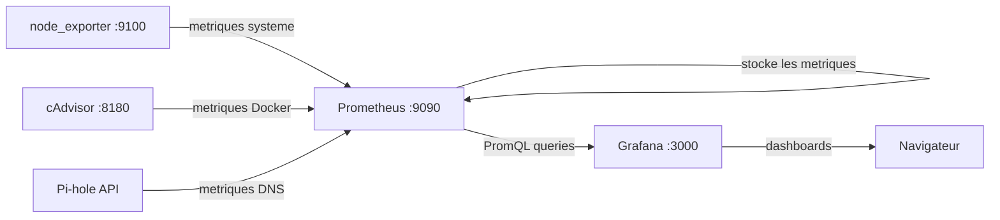

# Stack Monitoring : Prometheus + Grafana

## Architecture



## Prometheus

Prometheus scrape (collecte) les metriques de chaque exporter a intervalles reguliers et les stocke en local.

### Configuration type (`prometheus.yml`)

```yaml
global:
  scrape_interval: 15s        # Frequence de collecte
  evaluation_interval: 15s    # Frequence d'evaluation des alertes

scrape_configs:
  # Metriques systeme (CPU, RAM, disque, reseau)
  - job_name: 'node'
    static_configs:
      - targets: ['node_exporter:9100']

  # Metriques Docker (containers)
  - job_name: 'cadvisor'
    static_configs:
      - targets: ['cadvisor:8080']

  # Metriques Pi-hole
  - job_name: 'pihole'
    static_configs:
      - targets: ['pihole-exporter:9617']

  # Prometheus se monitore lui-meme
  - job_name: 'prometheus'
    static_configs:
      - targets: ['localhost:9090']
```

### Retention des donnees

```yaml
# Dans la commande de lancement de Prometheus
--storage.tsdb.retention.time=30d    # Garder 30 jours de metriques
--storage.tsdb.retention.size=5GB    # Limiter a 5 Go max
```

Sur un HDD de 2 To, 5 Go pour le monitoring est negligeable mais ca evite que ca grossisse indefiniment.

## Grafana

Grafana se connecte a Prometheus comme data source et permet de creer des dashboards visuels.

### Dashboards recommandes

| Dashboard | ID Grafana | Usage |
|-----------|-----------|-------|
| Node Exporter Full | 1860 | Metriques systeme completes |
| Docker monitoring | 893 | Etat des containers |
| Pi-hole Exporter | 10176 | Stats DNS et blocage |

Pour importer : Grafana > Dashboards > Import > Entrer l'ID.

## Requetes PromQL utiles

```promql
# Utilisation CPU (%)
100 - (avg(rate(node_cpu_seconds_total{mode="idle"}[5m])) * 100)

# RAM utilisee (%)
(1 - node_memory_MemAvailable_bytes / node_memory_MemTotal_bytes) * 100

# Espace disque restant (Go)
node_filesystem_avail_bytes{mountpoint="/mnt/data"} / 1024 / 1024 / 1024

# Nombre de containers Docker actifs
count(container_last_seen{name!=""})

# Requetes DNS bloquees par Pi-hole (par minute)
rate(pihole_domains_being_blocked[5m])
```

## Alertes (a configurer)

Exemples d'alertes utiles pour un homelab :

```yaml
# Dans Prometheus (alerting rules)
groups:
  - name: homelab
    rules:
      - alert: DiskSpaceLow
        expr: node_filesystem_avail_bytes{mountpoint="/mnt/data"} / node_filesystem_size_bytes{mountpoint="/mnt/data"} < 0.15
        for: 5m
        annotations:
          summary: "Espace disque < 15% sur le HDD de donnees"

      - alert: ContainerDown
        expr: absent(container_last_seen{name="immich"})
        for: 2m
        annotations:
          summary: "Container Immich down depuis 2 minutes"

      - alert: HighMemoryUsage
        expr: (1 - node_memory_MemAvailable_bytes / node_memory_MemTotal_bytes) > 0.9
        for: 5m
        annotations:
          summary: "RAM > 90% depuis 5 minutes"
```
