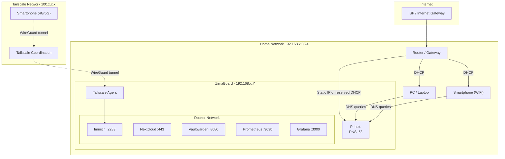

# Network Diagram

## Overview



## DNS Configuration with Pi-hole

All devices on the network use Pi-hole as the DNS server:

1. **Option 1**: Configure the router to distribute Pi-hole's IP via DHCP
2. **Option 2**: Configure each device manually

```
DNS request: "facebook.com"
  → Pi-hole checks its blocklist
  → If blocked: returns 0.0.0.0 (ad blocked)
  → If OK: forwards to upstream DNS (e.g., Cloudflare 1.1.1.1)
```

## Tailscale Network Flow

```
Smartphone (4G)
  → Tailscale client
  → Encrypted WireGuard tunnel
  → Tailscale relay (if no direct connection)
  → ZimaBoard Tailscale agent
  → Docker service (e.g., Immich :2283)
```

No open port on the router. Tailscale uses NAT traversal to establish a direct connection when possible, otherwise routes through a relay (DERP server).
