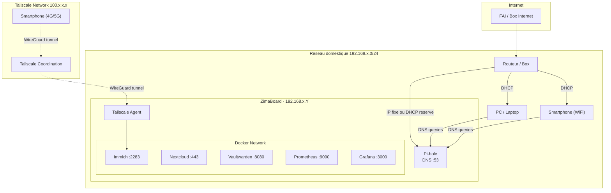

# Schema reseau

## Vue d'ensemble



## Configuration DNS avec Pi-hole

Tous les appareils du reseau utilisent Pi-hole comme serveur DNS :

1. **Option 1** : Configurer le routeur pour distribuer l'IP de Pi-hole via DHCP
2. **Option 2** : Configurer chaque appareil manuellement

```
Requete DNS: "facebook.com"
  → Pi-hole verifie sa blocklist
  → Si bloque: retourne 0.0.0.0 (pub bloquee)
  → Si OK: forward vers le DNS upstream (ex: Cloudflare 1.1.1.1)
```

## Flux reseau Tailscale

```
Smartphone (4G)
  → Tailscale client
  → Tunnel WireGuard chiffre
  → Tailscale relay (si pas de connexion directe)
  → ZimaBoard Tailscale agent
  → Service Docker (ex: Immich :2283)
```

Pas de port ouvert sur le routeur. Tailscale utilise du NAT traversal pour etablir une connexion directe quand possible, sinon passe par un relay (DERP server).
